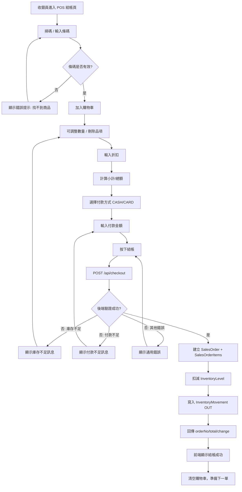

# POS 結帳流程圖（Sprint 2）

> 用途：先對齊實作流程，再開始前端 POS 結帳頁開發。

## High-level 流程

## 前端狀態（建議）

- `cartItems[]`: 目前購物車品項（productId, sku, name, unitPrice, qty, lineTotal）
- `discount`: 折扣金額
- `paymentMethod`: `CASH | CARD`
- `paidAmount`: 付款金額
- `checkoutError`: 結帳錯誤訊息（庫存不足 / 付款不足 / 其他）
- `lastOrderResult`: 最近一筆結帳結果（orderNo, total, change）

## API 契約（目前）

- `POST /api/checkout`
  - request:
    - `items[]`: `{ productId, qty }`
    - `paymentMethod`: `CASH | CARD`
    - `paidAmount`: decimal
    - `discount`?: decimal
    - `note`?: string
  - response:
    - `id`, `orderNo`, `total`, `changeAmount`, `items[]` ...

- `GET /api/orders`
- `GET /api/orders/{id}`

## 錯誤路徑（前端必做）

1. 條碼找不到商品
2. 庫存不足（後端回傳 `insufficient stock`）
3. 付款不足（後端回傳 `paid amount is insufficient`）
4. 卡片支付金額不等於總額（`CARD` 限制）
